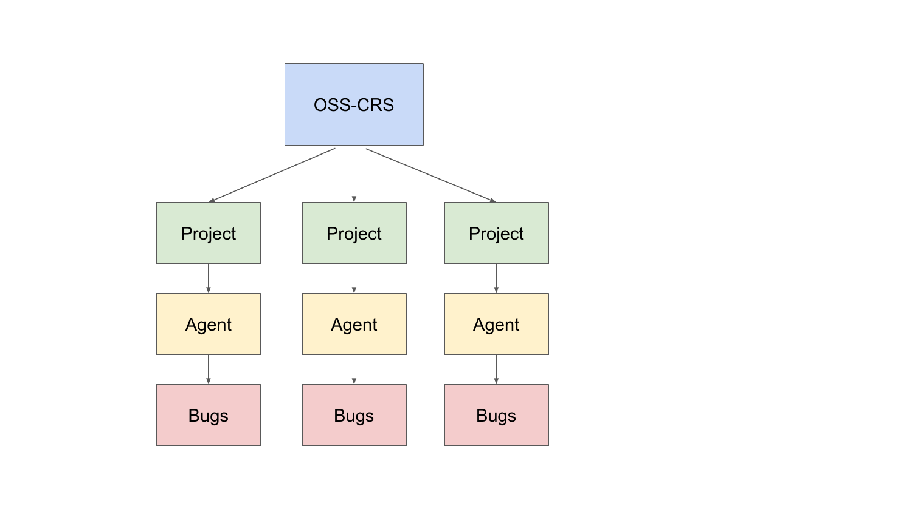
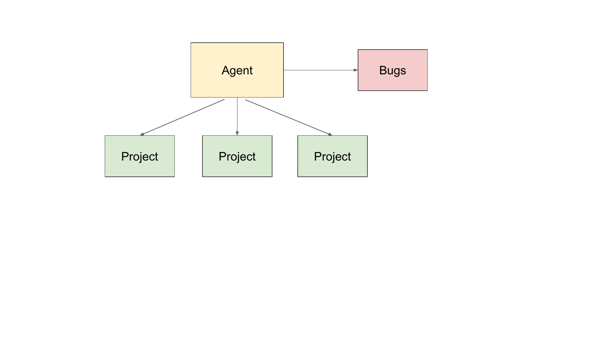
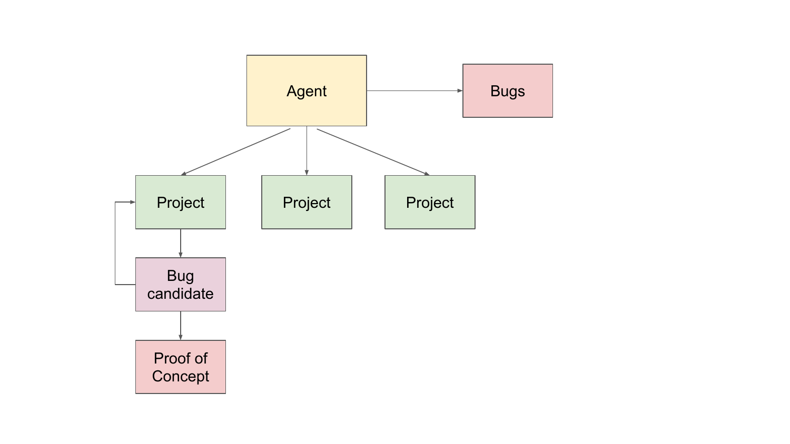
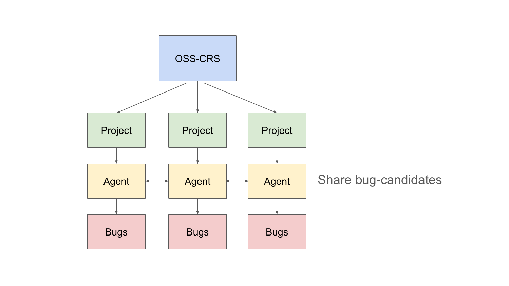
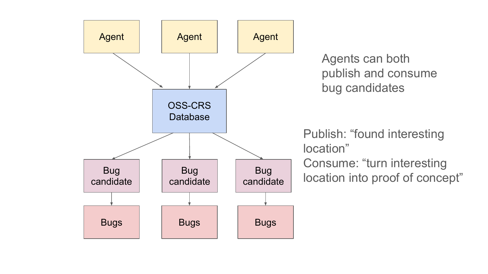
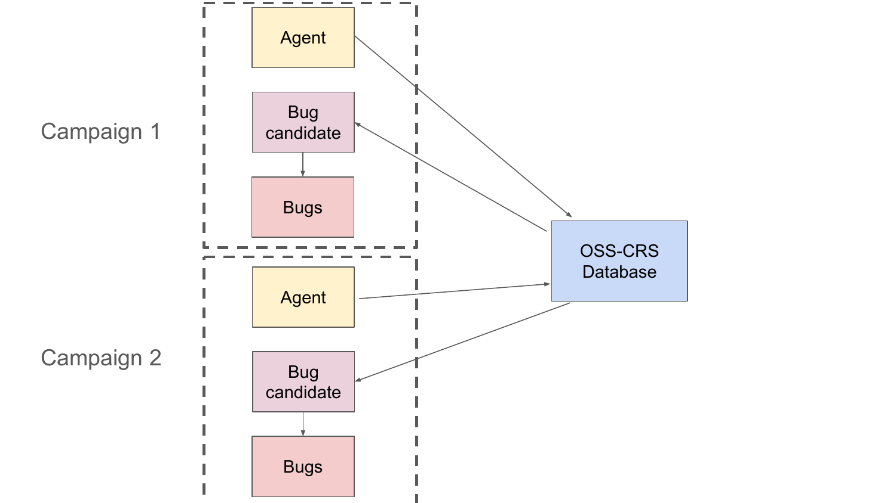
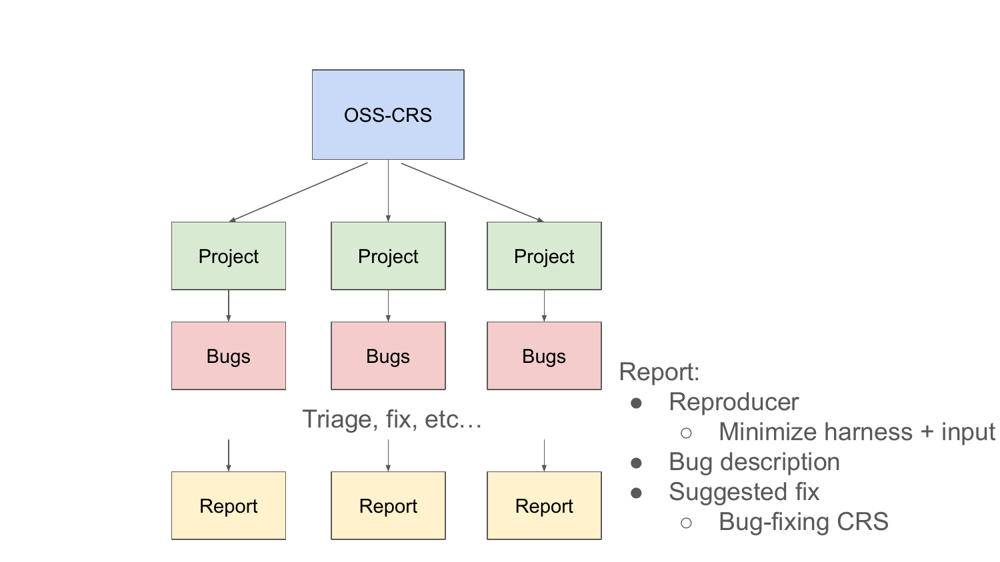
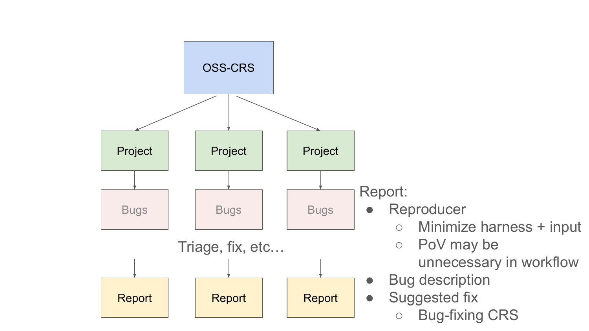
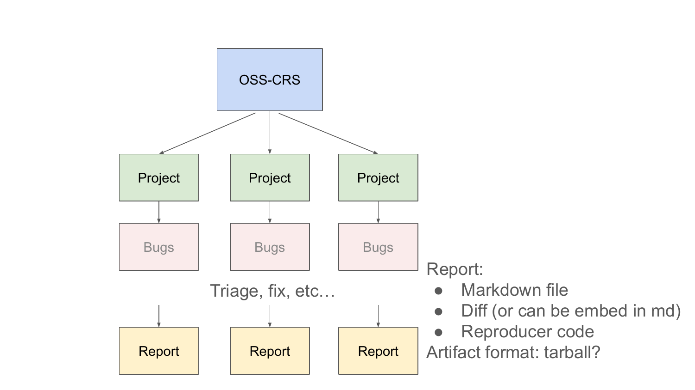
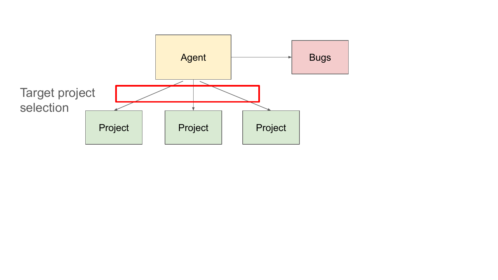

# Meeting Notes

OpenSSF Cyber Reasoning Systems Special Interest Group

2026-07-13

---

## Agenda

After running a bug-finding campaign both inside and outside of OSS-CRS, I would like to share some thoughts.
<!-- TODO change this a bit -->
<!-- - Bug-finding workflow -->
<!-- - Multi-source single agent -->
<!-- - Knowledge across time -->
<!-- - Knowledge across tools -->
<!-- - Bug-Fixing and Report Generation -->
<!-- - Rust CRS -->
<!-- - Target selection -->

<!-- Scope: a single bug-finding agent performs quite well -->
<!-- OSS-CRS should systemize the bug-finding agent in a way that it can be deployed against a single target, and be done hands-off -->

<!-- Problem: store context across multiple projects -->
<!-- Problem: store context over time -->

---

## OSS-CRS Deployment Workflow

---

## Agentic Bug-Finding

For security researchers, they tend to look for a particular bug across multiple projects.

---

## Agentic Bug-Finding

Internally, the agent searches for code that looks buggy (according to vulnerable patterns), then tries to create a proof-of-concept to prove the vulnerability.

---

## Gaps for OSS-CRS

Compared to running an agent that checks out many projects searching for domain specific bugs, OSS-CRS lacks:
- cross-project knowledge
- resumable context and campaigns
- automatic target selection

---

## Proposal: Rich Bug-Candidate Interface

[GH Issue 310](https://github.com/ossf/oss-crs/issues/310)

---

## Proposal: Rich Bug-Candidate Interface

---

---

## OSS-CRS: Report Generation

---

## OSS-CRS: Report Generation Workflow

---

## OSS-CRS: Report Generation Artifacts

---

## OSS-CRS: Report Generation Artifacts

Open question on whether it's in scope of OSS-CRS.

---

## Q&A / Discussion

Refer to Cyber Reasoning Systems bi-weekly meeting notes.
